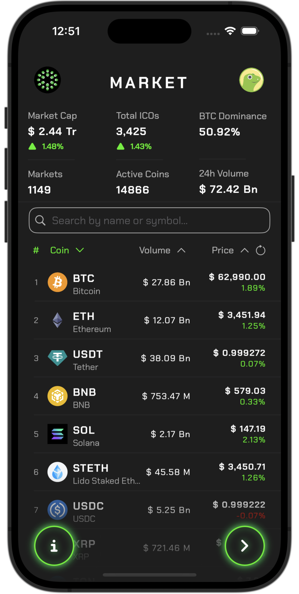
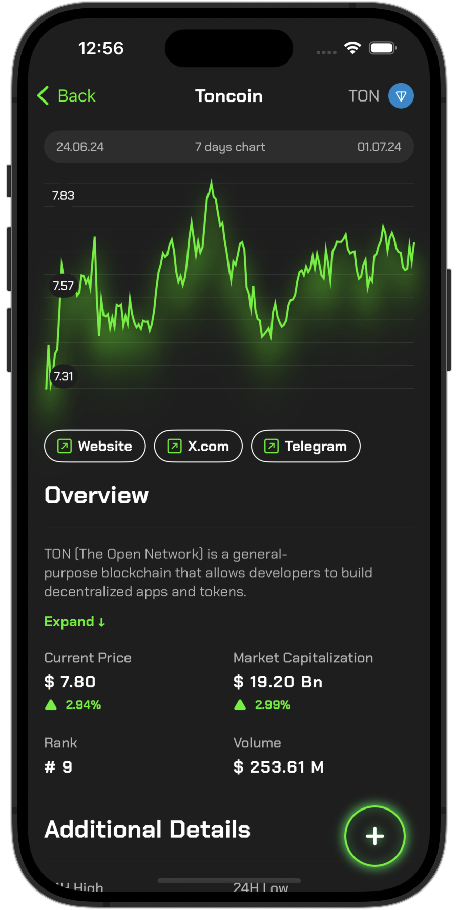
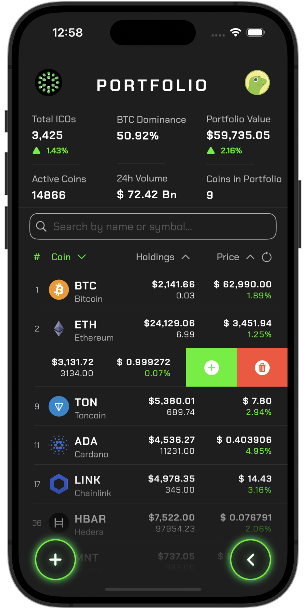
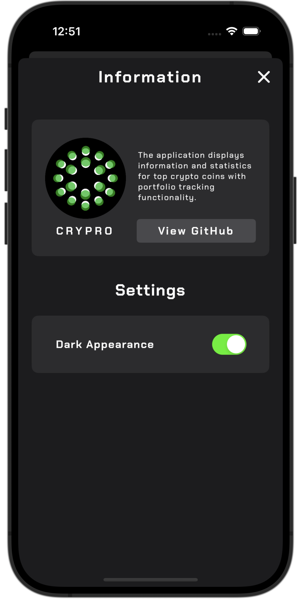
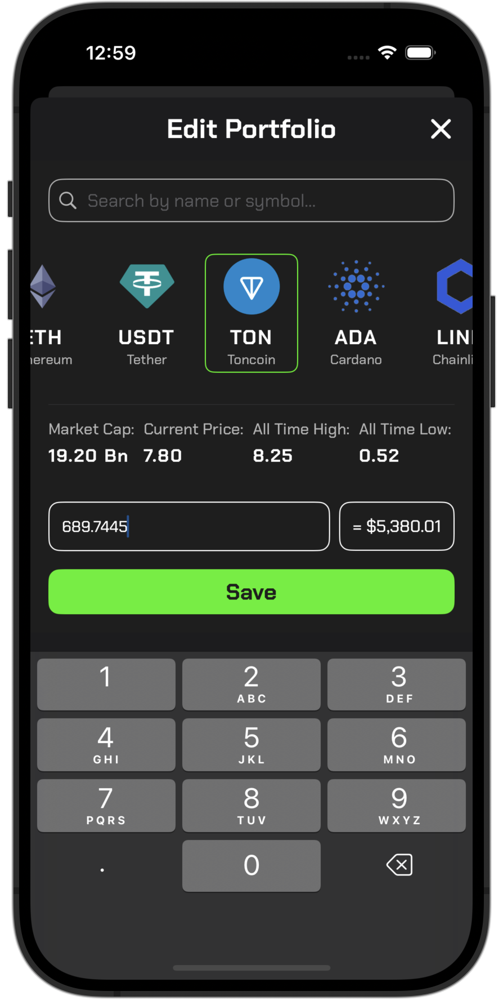
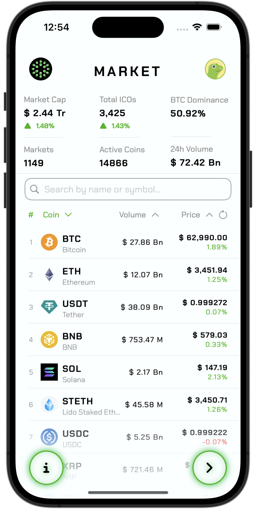
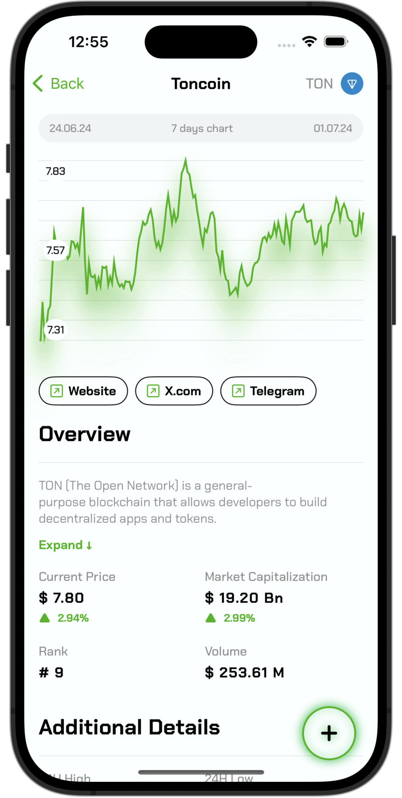
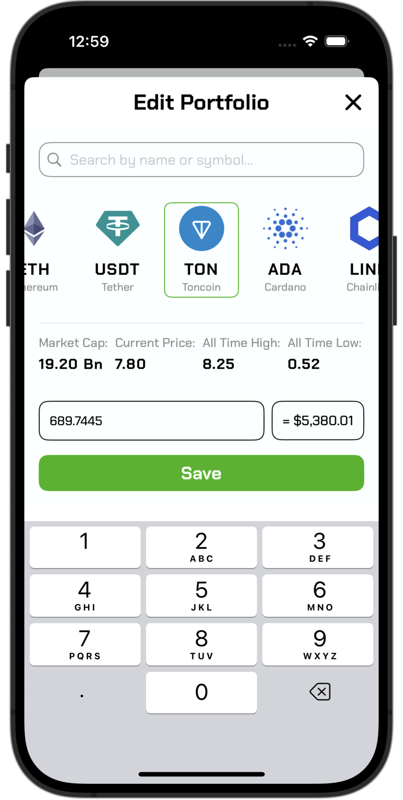
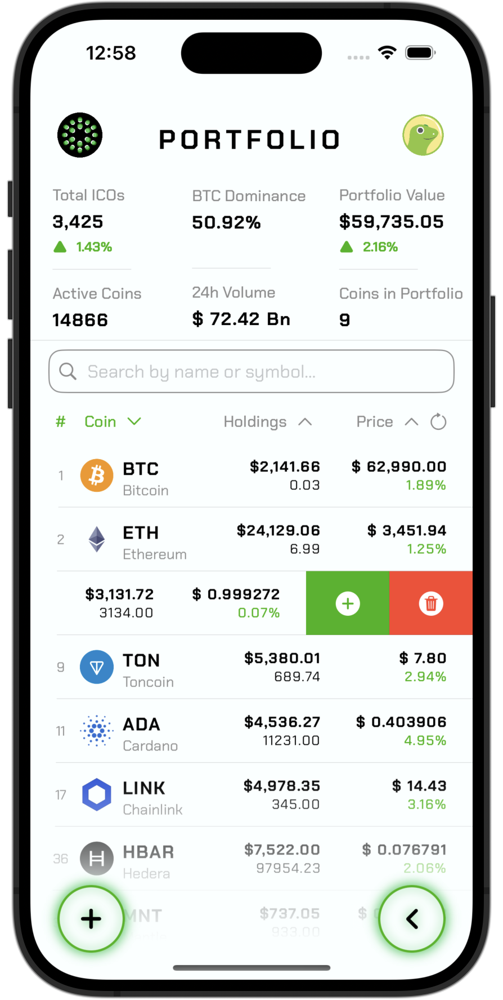
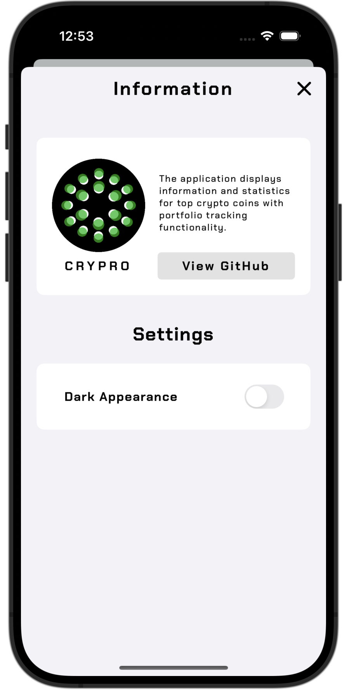

# CoinPulse

A comprehensive cryptocurrency tracking app for iOS, built entirely with SwiftUI. Real-time market data, portfolio management, and detailed coin analytics — all in a clean, native interface.

<p align="center">
  
  
  
  
</p>

## Features

- 📈 **Live Market Data** — Top coins with real-time prices and 7-day sparkline charts
- 💼 **Portfolio Tracking** — Add, edit, and monitor your crypto investments
- 📊 **Coin Details** — In-depth info, price history, and market statistics
- 🌙 **Dark & Light Mode** — Full theme support for comfortable viewing
- 🚫 **Zero Dependencies** — No third-party libraries, 100% native Swift

## Tech Stack

| Layer | Technology |
|-------|-----------|
| UI | SwiftUI |
| Async | Combine |
| Persistence | CoreData |
| Architecture | MVVM |
| Data Source | [CoinGecko API](https://www.coingecko.com/en/api) |

## Screenshots

### Dark Mode
| Market | Details | Transaction | Portfolio | Settings |
|:---:|:---:|:---:|:---:|:---:|
|  |  |  |  |  |

### Light Mode
| Market | Details | Transaction | Portfolio | Settings |
|:---:|:---:|:---:|:---:|:---:|
|  |  |  |  |  |

## Requirements

- iOS 16.0+
- Xcode 15+

## Getting Started

```bash
git clone https://github.com/minov9/CoinPulse.git
cd CoinPulse
open CoinPulse.xcodeproj
```

Build & Run with <kbd>⌘</kbd> + <kbd>R</kbd>

## License

[MIT](LICENSE)
